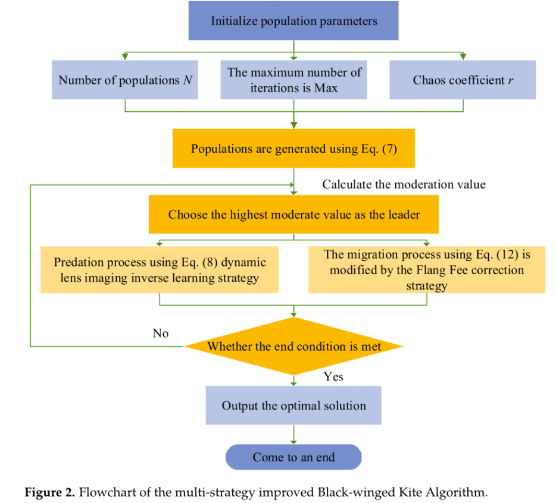
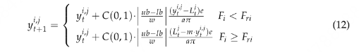

1.初始种群优化
2.搜索机制嵌入。执行一次A操作，再执行一次B操作。




基于这些分析，该研究选择e = 0.6和w = 3作为IBKA的参数。

黄金正弦变异

\```python
import math
import random
import numpy as np

def golden_sine_mutation(X, Best_pos, lb, ub, fobj):
    """
    黄金正弦变异操作
    :param X: 种群矩阵，形状为(pop_size, dim)
    :param Best_pos: 全局最优位置，形状为(dim,)
    :param lb: 变量下界，标量或数组
    :param ub: 变量上界，标量或数组
    :param fobj: 目标函数
    :return: 更新后的种群矩阵
    """
    pop_size, dim = X.shape
    temp = np.copy(X)
    
    # 黄金分割系数计算
    tau = (math.sqrt(5) - 1) / 2  # 黄金分割数补数 (≈0.618)
    x1 = -math.pi + (1 - tau) * 2 * math.pi
    x2 = -math.pi + tau * 2 * math.pi

    for i in range(pop_size):
        # 每个个体独立生成随机参数
        R1 = random.uniform(0, 2 * math.pi)  # 方向参数
        R2 = random.uniform(0, math.pi)      # 距离参数
        
        for d in range(dim):
            # 计算新位置
            term1 = X[i, d] * abs(math.sin(R1))
            term2 = R2 * math.sin(R1) * abs(x1 * Best_pos[d] - x2 * X[i, d])
            new_x = term1 + term2  # 公式中的加号
            
            # 边界约束处理
            if isinstance(lb, (list, np.ndarray)):
                new_x = max(min(new_x, ub[d]), lb[d])
            else:
                new_x = max(min(new_x, ub), lb)
                
            temp[i, d] = new_x

        # 贪婪选择保留更优解
        if fobj(temp[i]) < fobj(X[i]):
            X[i] = temp[i].copy()
            
    return X
\```

弗劳恩霍夫衍射搜索策略

\```python
                if self.XFit[i] < r_XFitness:
                    XPosNew = self.XPos[i] + cauchy_value * (self.XPos[i] - XLeader_Pos) * np.abs((self.ub-self.lb)/self.w)*self.e/(self.a*np.pi)
                else:
                    XPosNew = self.XPos[i] + cauchy_value * (XLeader_Pos - m * self.XPos[i]) * np.abs((self.ub-self.lb)/self.w)*self.e/(self.a*np.pi)
\```

透镜原理

\```python
            k = 2 * r
                XPosNew = (self.ub + self.lb)*(0.5 + 1/2*k) - XPosNew/k
\```

SFS机制---张谦论文：直接缝合两个优化算法

'''
import numpy as np

def SFS(pop_size, dim, lb, ub, max_iter, fobj):
    # 初始化种群
    population = np.random.uniform(lb, ub, (pop_size, dim))
    fitness = np.array([fobj(ind) for ind in population])
    
    for iter in range(max_iter):
        # 扩散阶段
        for i in range(pop_size):
            step = np.random.normal(0, 1, dim)
            new_position = population[i] + step
            new_position = np.clip(new_position, lb, ub)
            new_fitness = fobj(new_position)
            if new_fitness < fitness[i]:
                population[i] = new_position
                fitness[i] = new_fitness
        
        # 强制阶段
        for i in range(pop_size):
            step = np.random.standard_cauchy(dim)
            new_position = population[i] + step
            new_position = np.clip(new_position, lb, ub)
            new_fitness = fobj(new_position)
            if new_fitness < fitness[i]:
                population[i] = new_position
                fitness[i] = new_fitness
    
    best_index = np.argmin(fitness)
    best_solution = population[best_index]
    best_fitness = fitness[best_index]
    
    return best_solution, best_fitness
'''